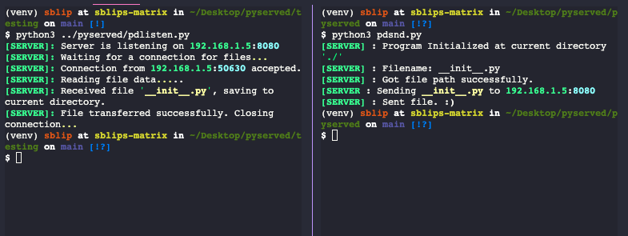

<div align="center"></div>

# PyServed v2.0.5
<a href="https://pepy.tech/project/pyserved"></a>
<a href="https://pypi.org/project/pyserved"></a>
<a href="https://github.com/shaurya-blip/pyserved"></a>
<a href="https://github.com/shaurya-blip/pyserved"></a>

A beautiful cli made with python which can send files with blazing speed. Initialized and setup using `Choam` by [Kian McKenna](https://github.com/cowboycodr)

<!--  -->
     
## Installation

Using pip(for stable releases.) ->

```
$ pip install pyserved
```

Using Git (for latest updates) ->

```
$ git clone https://github.com/SblipDev/pyserved.git
$ python3 setup.py install
```

## Usage

Once installed, you will be able to send files across computers with the package and python on it. 
If there is any problem you can file and issue on this repo.

### To listen for files

To send files, you will have to run the following command (The correct output is also shown): 

```
$ pdlisten

[SERVER]: Server is listening on 192.168.1.5:8080
[SERVER]: Waiting for a connection for files...
```

To change the default port(8080), add the '-port XXXX' argument to the command and try again. 
If someone else conects using the pyserved 'pdsnd' command, enter the connection key which is showed. It will write the file to the current working directory

### To get files.

To send files, you will have to run the `pdsnd` command. It will prompt for the filepath of the file you want to send.
If everything goes right, the file will be sent to the person listening in the same network.
To change the default port(8080), add the '-port XXXX' argument to the command and try again.

```
$ pdsnd

[SERVER] : Program Initialized at current directory './'
[SERVER] : Connection Key:
[SERVER] : Filename: 
```


## Thats it. 
Feel free to contribute to the package. I personally would really appreciate it.
Have a nice day   
