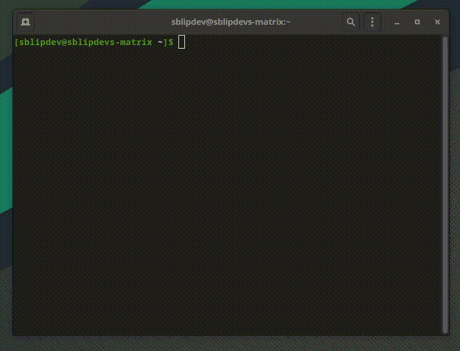
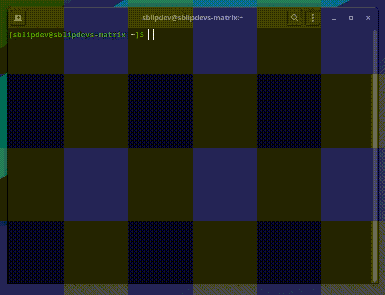
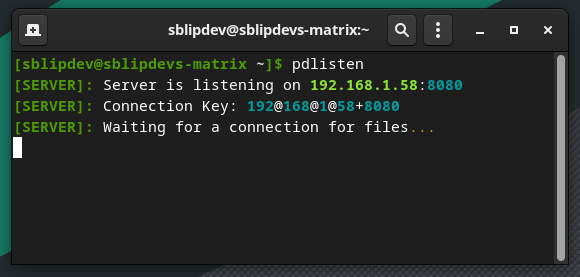
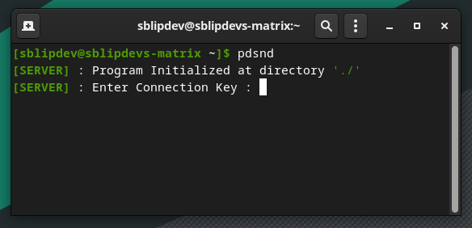
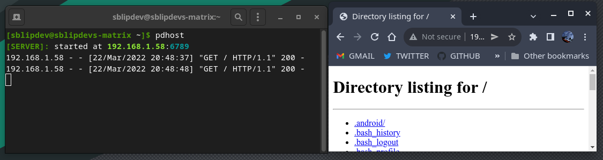

<div align="center"></div>

# PyServed v2.0.8
<a href="https://pepy.tech/project/pyserved"></a>
<a href="https://pypi.org/project/pyserved"></a>
<a href="https://github.com/SblipDev/pyserved"></a>
<!-- <a href="https://github.com/SblipDev/pyserved"></a> -->

A beautiful cli with network transfer/hosting utilities to make life easier.<br>

## Installation

#### Using pip (recommended) ->



```
$ pip install pyserved
```

Pypi Link -> https://pypi.org/project/pyserved/

#### Using Git and SETUP.py install (for latest updates) ->



```
$ git clone https://github.com/SblipDev/pyserved.git
$ cd pyserved
$ python3 setup.py install
```

## Usage

Once installed, you will be able to send files across computers with the package and python on it OR
you can host a folder on network so anyone on network may download its contents.
If there is any problem you can file and issue on this repo.

### To listen for files

<br><br>

To send files, you will have to run the following command (The correct output is also shown): 

```
$ pdlisten

[SERVER]: Server is listening on 192.168.1.5:8080
[SERVER]: Connection Key: 192@168@1@58+8080
[SERVER]: Waiting for a connection for files...
```

To change the default port(8080), add the '-port XXXX' argument to the command and try again. 
If someone else conects using the pyserved 'pdsnd' command, enter the connection key which is showed. It will write the file to the current working directory

### To get files.

<br><br>

To send files, you will have to run the `pdsnd` command. It will prompt for the filepath of the file you want to send.
If everything goes right, the file will be sent to the person listening in the same network.
To change the default port(8080), add the '-port XXXX' argument to the command and try again.

```
$ pdsnd

[SERVER] : Program Initialized at current directory './'
[SERVER] : Connection Key: {Connection Key from pdlisten program}
[SERVER] : Filename: {Path of file which you want to transfer.}
```

### To host folder.

<br><br>

To host a folder, you have to use the `pdhost` command. You can use the `-port` command so you may change the default port `6789`.
PS. Don't use in production environments! It only has basic security features!

```
$ pdhost -port 7070

[SERVER]: started at 192.168.1.58:7070
192.168.1.58 - - [22/Mar/2022 20:15:54] "GET / HTTP/1.1" 200 -
192.168.1.58 - - [22/Mar/2022 20:15:55] code 404, message File not found
192.168.1.58 - - [22/Mar/2022 20:15:55] "GET /favicon.ico HTTP/1.1" 404 -
```

## Thats it. 
Have a nice day   

## LICENSE

```
MIT License

Copyright (c) 2022 SblipDev.

Permission is hereby granted, free of charge, to any person obtaining a copy
of this software and associated documentation files (the "Software"), to deal
in the Software without restriction, including without limitation the rights
to use, copy, modify, merge, publish, distribute, sublicense, and/or sell
copies of the Software, and to permit persons to whom the Software is
furnished to do so, subject to the following conditions:

The above copyright notice and this permission notice shall be included in all
copies or substantial portions of the Software.

THE SOFTWARE IS PROVIDED "AS IS", WITHOUT WARRANTY OF ANY KIND, EXPRESS OR
IMPLIED, INCLUDING BUT NOT LIMITED TO THE WARRANTIES OF MERCHANTABILITY,
FITNESS FOR A PARTICULAR PURPOSE AND NONINFRINGEMENT. IN NO EVENT SHALL THE
AUTHORS OR COPYRIGHT HOLDERS BE LIABLE FOR ANY CLAIM, DAMAGES OR OTHER
LIABILITY, WHETHER IN AN ACTION OF CONTRACT, TORT OR OTHERWISE, ARISING FROM,
OUT OF OR IN CONNECTION WITH THE SOFTWARE OR THE USE OR OTHER DEALINGS IN THE
SOFTWARE.
```